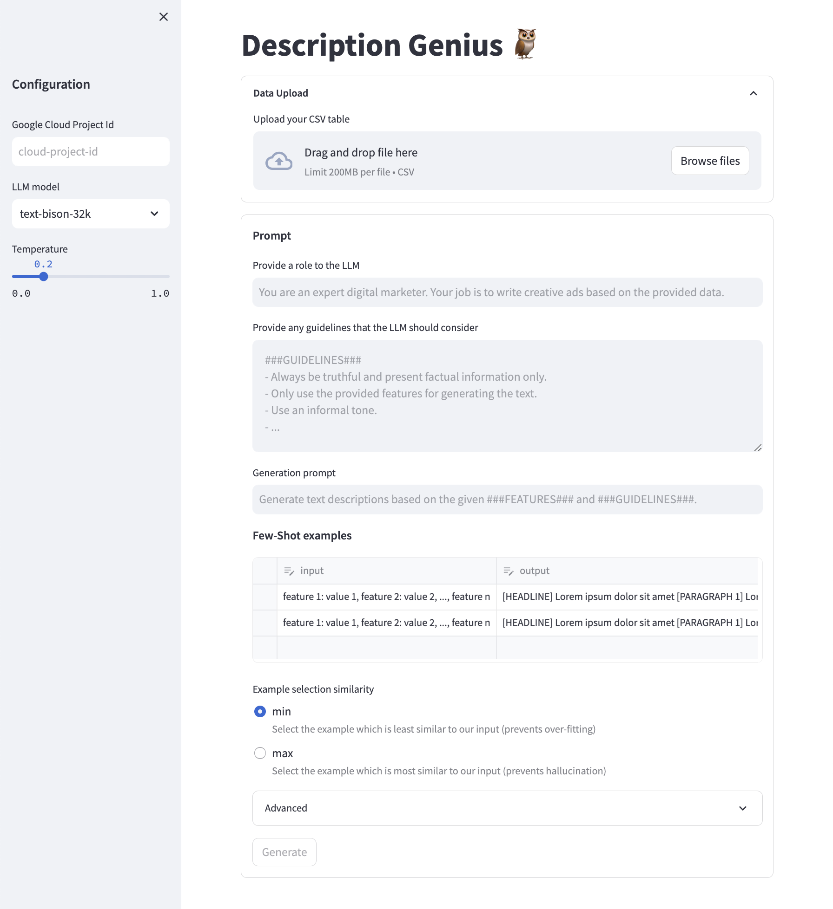
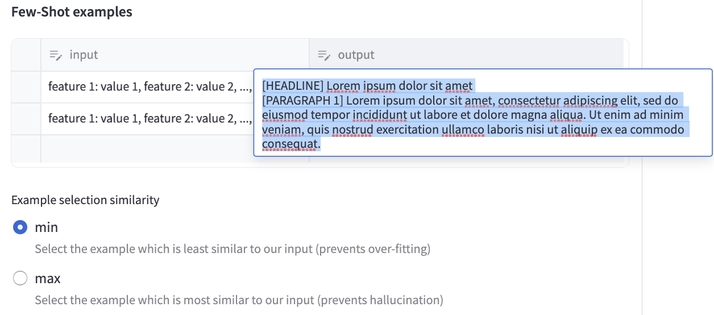
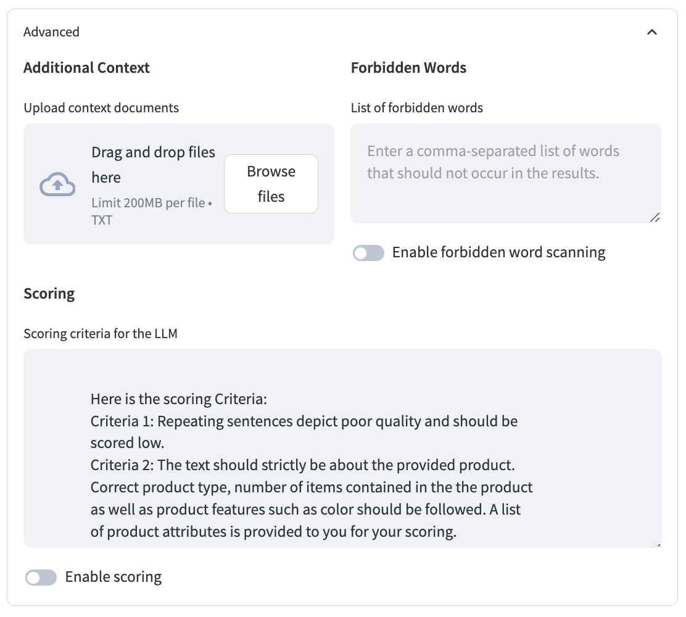

# Description Genius 🦉
[Overview](#overview) • [Updates](#updates) • [Requirements](#requirements) • [Features](#features) • [Getting Started](#getting-started) • [Advanced Features](#advanced-features) •  [Disclaimer](#disclaimer)

## Overview
Easily generate captivating product descriptions using product features and any additional sources of information that you may have e.g. product reviews, usage instructions etc.

## Updates
* **May 2024**
    * Support for image inputs using [Gemini Pro Vision](https://cloud.google.com/vertex-ai/generative-ai/docs/multimodal/overview#multimodal_models)

* **April 2024**
    * Product image preview alongside text for easier review.
    * Scoring improvements.

* **December 2023**
    * Support for [Gemini Pro](https://cloud.google.com/vertex-ai/docs/generative-ai/model-reference/gemini).
    * Feature to regenerate selected descriptions.

* **November 2023**. Minor security updates and version bumps.

* **October 2023**. Initial release.

## Requirements
Description Genius uses Google Cloud Platform's [Vertex AI language models](https://cloud.google.com/vertex-ai/docs/generative-ai/language-model-overview) to generate product descriptions. In order to use Description Genius, you need access to a Google Cloud Project with the [Vertex AI API](https://cloud.google.com/vertex-ai/docs/generative-ai/start/quickstarts/api-quickstart) enabled.

## Features
Description Genius brings the latest advances in Generative AI in an easy to use package.

The interactive UI lets you upload a CSV file containing a list of your products alongside their features. An example CSV file could look like this:

| Id | Color | Material | Product Group | Sizes | Price | Care Guide |
|---|---|---|---|---|---|---|
| 1 | Black | Leather | Pants | s/m/l | $250 | Hand wash |
| 2 | Purple | Cotton | Sweater | m | $99 | Machine washable at 45C |

### Description Format
Description Genius can generate product descriptions in the format of your choice. Be it a single paragraph, multiple paragraphs with headlines or even HTML tags.

Simply provide a few examples of your input and output (in the format of your choice) under the Few-Shot examples section.

> Tip: For the best results, make sure you provide at least three examples for our model to learn from.

## Getting Started
Description Genius comes with an easy to use UI built on top of [Streamlit](https://streamlit.io/).

To get started:
1) Clone this repository
2) Change to the project directory and install the required libraries using `pip install -r requirements.txt`
3) Launch the app using `streamlit run app.py`

This should open up a browser window with the Description Genius UI. Simply upload a CSV file containing your product features alongside a prompt for the language model. Also provide a few examples of how your output should look like. Optionally, you can include additional sources of information such as styling guidelines, material information etc.

Once done, click on `Generate`. Description Genius will now generate your descriptions and output them in a table directly in the UI. You can now make any edits to the generated text and finally download it by clicking the `Download data as CSV` button.

### Potential Problems
You may see the error `fatal error: Python.h: No such file or directory` when installing the dependencies with pip. To remedy this, install the python3 development headers (e.g. with `apt install python3-dev`).

## Advanced Features
Description Genius offers a number of advanced features to improve the quality and reliability of your generated descriptions.

### Additional Context
When generating descriptions, you might want to provide additional information that is relevant for your products. For example, if you are a fashion retailer selling clothing, you might have additional guidelines for your customers on how to take care of their clothing depending on the materials used or how to mix and match with other products to create a trendy outfit. Description Genius allows you to upload any number of text files containing this additional information. Using vector search, we extract the relevant portions of text for each product and pass that as additional context to the LLM, enabling it to generate even more relevant and higher quality descriptions.

### Forbidden Words
You might have specific requirements about words that should never appear in your descriptions. For example, you might want to avoid overly promising claims such as "this product is *perfect* for all occasions". With Description Genius, you can input a list of words that should never appear in your descriptions. We then automatically find any instances of these words in the output, allowing you to immediately correct or regenerate the undesirable descriptions.

### Automated Scoring
If you are generating a large number of descriptions, it might be infeasible to manually check all of the generated text against your quality criteria. Description Genius allows you to provide a custom quality criteria and scores the generated description against the given criteria. Now you can quickly identify low scoring descriptions and correct or regenerate them.

## Disclaimer

**This is not an officially supported Google product.**

*Copyright 2023 Google LLC. This solution, including any related sample code or data, is made available on an “as is,” “as available,” and “with all faults” basis, solely for illustrative purposes, and without warranty or representation of any kind. This solution is experimental, unsupported and provided solely for your convenience. Your use of it is subject to your agreements with Google, as applicable, and may constitute a beta feature as defined under those agreements. To the extent that you make any data available to Google in connection with your use of the solution, you represent and warrant that you have all necessary and appropriate rights, consents and permissions to permit Google to use and process that data. By using any portion of this solution, you acknowledge, assume and accept all risks, known and unknown, associated with its usage, including with respect to your deployment of any portion of this solution in your systems, or usage in connection with your business, if at all.*
